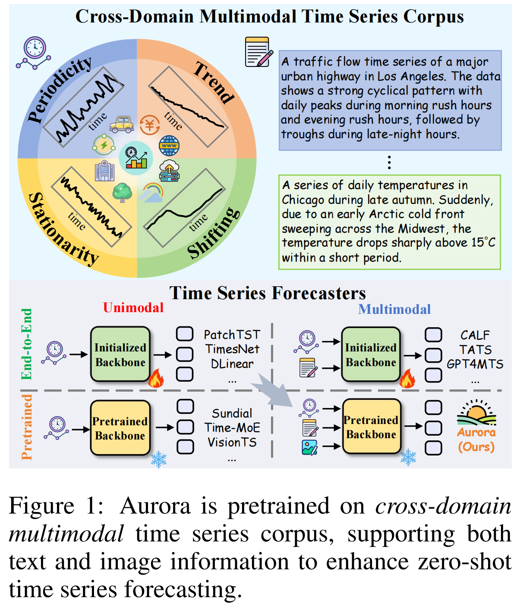
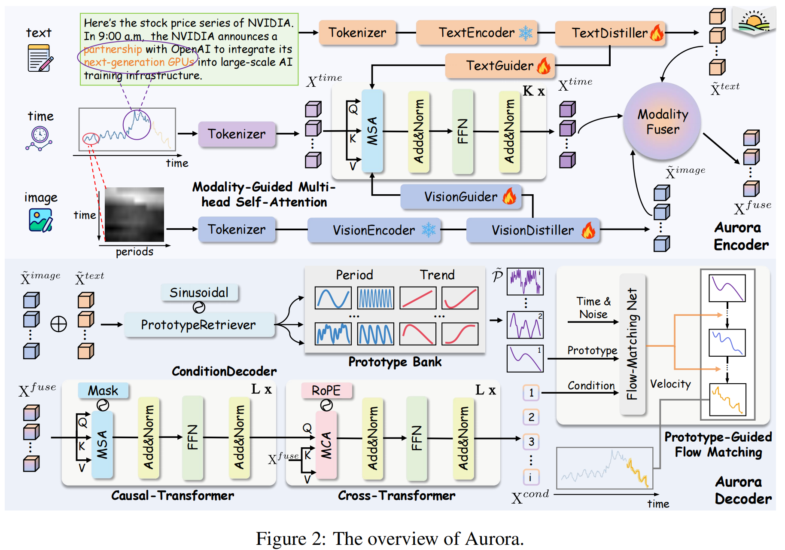
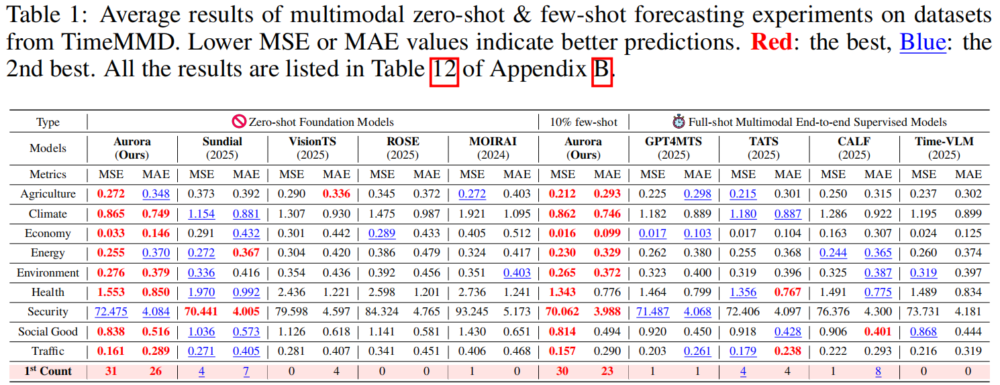
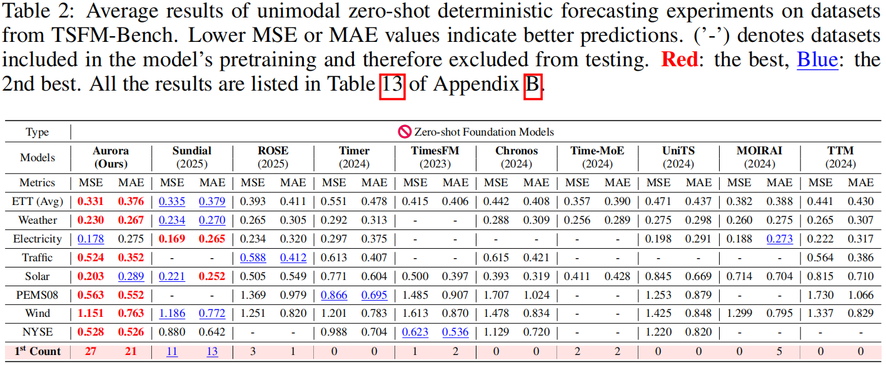
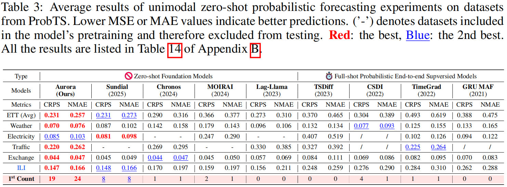
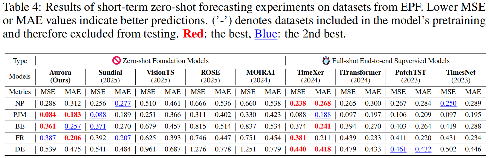
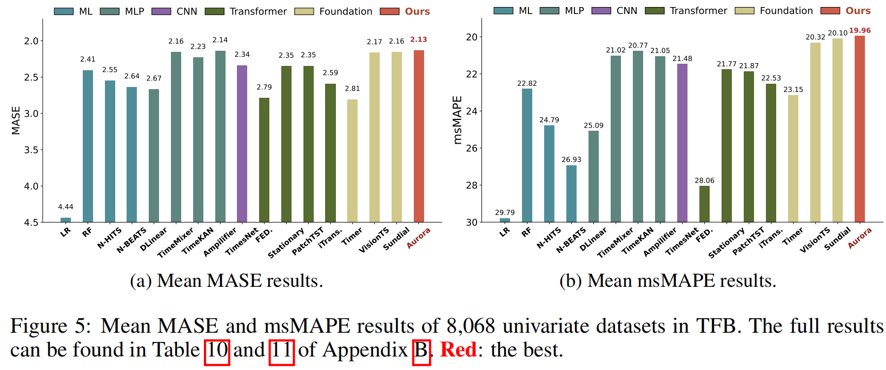

#  Aurora: Towards Universal Generative Multimodal Time Series Forecasting

**The official code repo of our ICLR 26's paper: [Aurora: Towards Universal Generative Multimodal Time Series Forecasting](https://arxiv.org/pdf/2509.22295) **

[](https://arxiv.org/pdf/2509.22295)  [](https://www.python.org/)  [](https://pytorch.org/)   


## Introduction

Aurora is a highly capable multimodal time series foundation model. Based on the **Modality-Guided Multi-head Self-Attention** and  **Prototype-Guided Flow Matching**, Aurora can effectively utilize the domain-specific knowledge contained in modalities and support generative probabilistic forecasting, thus covering versatile forecasting scenarios.

See **Figure 1**, to our best knowldege, Aurora is the first pretrained multimodal time series foundation model! Evaluated on three well-recognized benchmarks, including TimeMMD, TSFM-Bench, and ProbTS, Aurora is demonstrated the state-of-the-art.

<div align="center">

</div>

## Architecture

In this work, we pretrain Aurora in a cross-modality paradigm, which adopts Channel-Independence on time series data, and models corresponding multimodal interaction to inject domain knowledge. Note that the each variable of time series is first normalized through Instance Normalization to mitigate the value discrepancy. See **Figure 2**, Aurora mainly consists of two phases: 1) in Aurora Encoder, we tokenize and encode each modality into modal features, then fuse them to form multimodal representations; 2) in Aurora Decoder, we utilize a Condition Decoder to obtain the multimodal conditions of future tokens, leverage a Prototype Retreiver to retrieve the future prototypes based on the domain knowledge, and conduct flow matching on them to make generative probabilistic forecasts.

<div align="center">

</div>

## Quickstart

We release the original code of Aurora in this repo. You can also download the pretrained checkpoints in our [huggingface](https://huggingface.co/DecisionIntelligence/Aurora) repo and put them in the folder: aurora/.

If you want to pretrain an Aurora on your own time series corpus, you need to install the following important packages:

```shell
$ pip install torch==2.4.0
$ pip install torchvision==0.19.0
$ pip install transformers[torch]
```


## Experiments

For benchmarking (TSFM-Bench, ProbTS, TimeMMD, TFB, and EPF), you can install additional packages based on the requirement files under folders, and the datasets can be fetched from this [link](https://drive.google.com/file/d/12tJk858WaoG7ZVSvUq8KU1oHfGNJrARF/view?usp=drive_link). All experimental results can be reproduced by running the scripts in the benchmark folder：

```shell
# TimeMMD
TimeMMD/scripts/run_aurora_timemmd_zero_shot.sh

# EPF
EPF/scripts/run_aurora_short_term_zero_shot.sh

# ProbTS
ProbTS/scripts/run_aurora_probts.sh

# TSFM-Bench
TFB/scripts/run_aurora_tfb.sh

# TFB univaraite
TFB/scripts/run_aurora_uni.sh
```


## Performance

**Aurora ahieves consistent state-of-the-art performance on these 5 benchmarks:**

<div align="center">

</div>

<div align="center">

</div>

<div align="center">

</div>

<div align="center">

</div>

<div align="center">

</div>


## Citation

If you find this repo useful, please cite our paper.

```latex
@inproceedings{wu2026aurora,
  title     = {Aurora: Towards Universal Generative Multimodal Time Series Forecasting},
  author    = {Wu, Xingjian and Jin, Jianxin and Qiu, Wanghui and Chen, Peng and Shu, Yang and Yang, Bin and Guo, Chenjuan},
  booktitle = {ICLR},
  year      = {2026}
}
```


## Contact

If you have any questions or suggestions, feel free to contact:

- [Xingjian Wu](https://ccloud0525.github.io/) ([xjwu@stu.ecnu.edu.cn](mailto:xjwu@stu.ecnu.edu.cn))
- [Peng Chen](https://pengchen12.github.io/) (pchen@stu.ecnu.edu.cn)

Or describe it in Issues.
